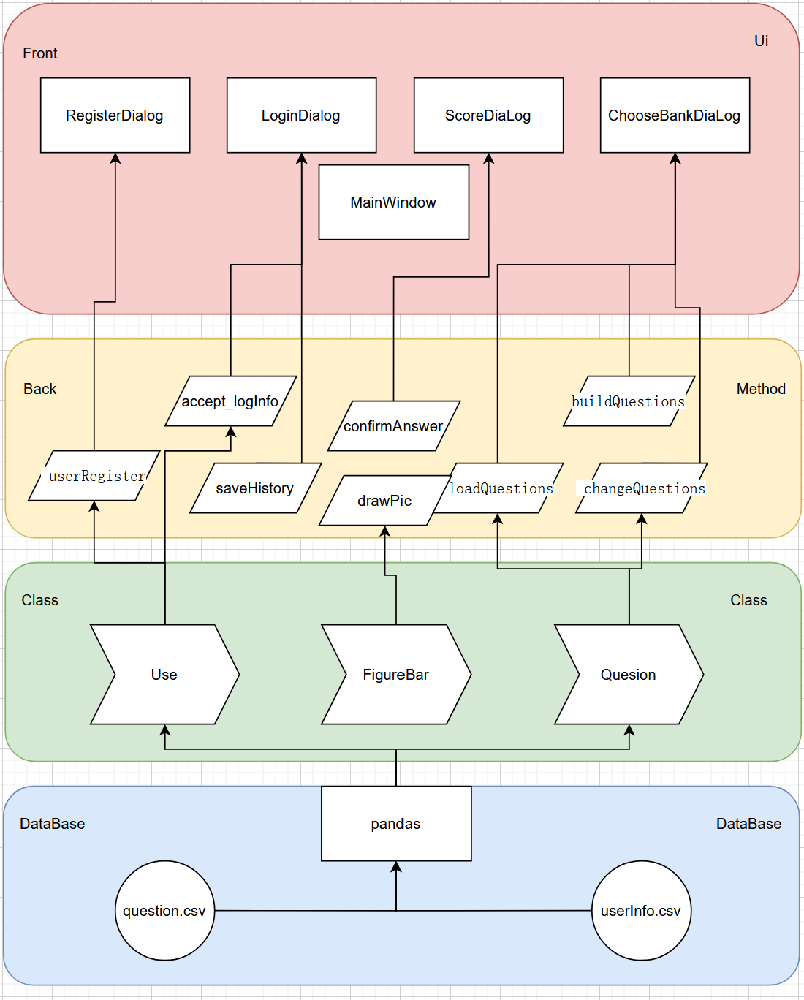

# AutoTest_UI

> a multi-user UI(python) supports user quizing (Final work for BUAA-Pyhton-2021)   
>
> Final work for BUAA-Pyhton-2021


## Basic Design




## tricks learned

#### Implement foreground background separation in QT (Python)

`gui_front.py` as front page buids framework of the UI-window through     building a class. `gui_back.py` builds a new class to extends the class in front, add attributes and other function call to implement business logic. i.e.

```python
# front
class Ui_MainWindow(PyQt5.QtWidgets.MainWindow):
	def setupUi(self, MainWindow):
		...
	def retranslateUi(self, MainWindow):
		...

# back
class MyWindow(QMainWindow, gui_front.Ui_MainWindow):
    def __init__(self, parent=None):
        super(MyWindow, self).__init__(parent)
        self.setupUi(self)
        ...attributes
    
    ...Business logic function call  
```

same apply to `QDialog` and other `QtWidgets`.


#### matplotlib canvas interface to Qt.stateGraph

create a class `Figure_Bar` extends `matplotlib.backends.backend_qt5agg.FigureCanvasQTAgg`, buid connection between `pyplot.figure` and `QT.stateGraph`, call `showimg` function in `Figure_Bar` when UI need picture refreshed.

```
# gui_back.py
self.myImage = draw.Figure_Bar(width, height)
self.myQGraphicsProxyWidget = self.myGraphyScene.addWidget(self.myImage)
```

```python
# draw.py
import matplotlib
matplotlib.use("Qt5Agg")
from matplotlib.backends.backend_qt5agg import FigureCanvasQTAgg
from matplotlib import pyplot

pyplot.rcParams['font.sans-serif'] = ['SimHei']
pyplot.rcParams['axes.unicode_minus'] = False


class Figure_Bar(FigureCanvasQTAgg):

    def __init__(self, width, height, parent=None):
        self.fig = pyplot.figure(figsize=(width, height), facecolor='#FFFFFF', dpi=100, edgecolor='#FFFFFF')
        FigureCanvasQTAgg.__init__(self, self.fig)
        self.setParent(parent)

        self.myAxes = self.fig.add_subplot(111)

    def ShowImage1(self, correctTime, answerTime):
        self.myAxes.clear()
        self.myAxes.barh([0], [answerTime],  height=0.01, color='red', label="FalseTimes", align='center')
        self.myAxes.legend()
        self.myAxes.barh([0], [correctTime], height=0.01, color='green', label="correctTimes", align='center')
        self.myAxes.legend()
        self.fig.canvas.draw()
```

